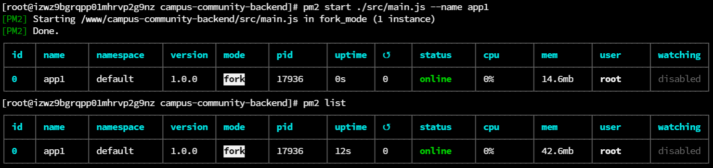
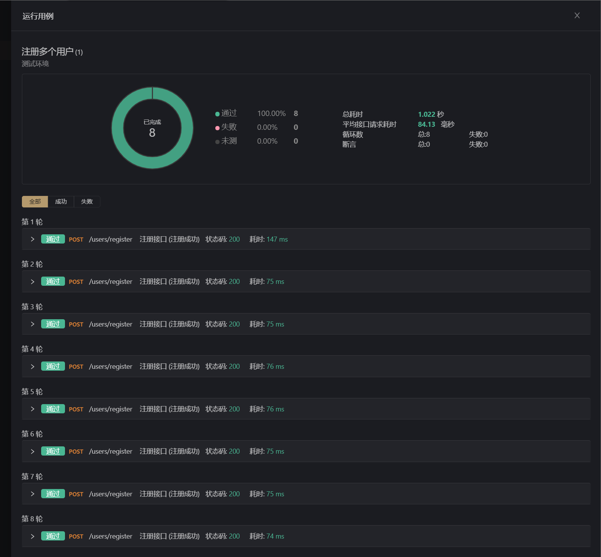

<!--
 * @Author: 41
 * @Date: 2022-02-17 16:53:33
 * @LastEditors: 41
 * @LastEditTime: 2022-02-20 22:23:20
 * @Description: 
-->
# 搭建过程记录
## 一.项目初始化
### 1.npm初始化
```bash
npm init -y
```
生成`package.json`文件:
- 记录项目的依赖

### 2.git初始化
```bash
git init
```
生成`.git`隐藏文件夹,git的本地仓库

### 3.创建readme文件

## 二.搭建项目
### 1.安装Koa框架
```bash
npm install koa
```
### 2.编写最基础的app
创建`src/main.js`
```javascript
// 导入包
const Koa = require('koa')
// 创建app实例
const app = new Koa()
// 创建中间件
app.use((ctx, next) => {
  ctx.body = 'hello api'
})
// 监听端口
app.listen(3000, () => {
  console.log('server is running on http://localhost:3000');
})
```
### 3.测试
在终端，使用`node src/main.js`

## 三.项目的基本优化
### 1.自动重启服务
- 安装nodemon工具
```bash
npm i nodemon -D
```
- 编写package.json脚本
```json
  "scripts": {
    "dev": "nodemon ./src/main.js",
    "test": "echo \"Error: no test specified\" && exit 1"
  }
```
- 执行`npm run dev`启动服务

### 2.读取配置文件
- 安装`dotenv`，读取根目录中的`.env`文件，将配置写`process.nev`中
```bash
npm i dotenv
```
- 创建`.env`文件
```bash
APP_PORT=8000
```
- 创建`src/config.config.default.js`

```javascript
// 导入包
const dotenv = require('dotenv')
// 获取信息
dotenv.config()

// console.log(process.env.APP_PORT);

// 导入对象
module.exports = process.env
```
- 改写`main.js` 导入配置和使用模板字符串

## 四.添加路由
路由:根据不同的URL，调用对应处理函数
### 1.安装koa-router
```bash
npm i koa-router
```
- 1.导入包
- 2.实例化对象
- 3.编写路由
- 4.注册中间件
### 2.编写路由
- 创建`src/routers`目录，编写`user.route.js`
```js
const Router = require('koa-router')

const router = new Router({ prefix: '/users' })

// GET /users/
router.get('/', (ctx, next) => {
  ctx.body = 'hello users'
})

module.exports = router
```
### 3.改写main.js
- 导入路由
- 注册中间件

## 五.目录结构的优化
### 1.将http服务和app业务拆分
- 创建`src/app/index.js`
```js
// 导入包
const Koa = require('koa')
// 创建app实例
const app = new Koa()
// 导入封装好的路由
const userRouter = require('../routers/user.route')
// 创建中间件
app.use(userRouter.routes())

module.exports = app
```
***
- 改写`main.js`
```js
// 导入设置的端口号
const { APP_PORT } = require('./config/config.default')
// 导入封装的app
const app = require('./app/index')
// 监听端口
app.listen(APP_PORT, () => {
  //使用模板字符串输出端口
  console.log(`server is running on http://localhost:${APP_PORT}`);
})
```

### 2.将路由和控制器拆分
- 路由:解析URL，分发给控制器对应的方法
- 控制器:处理不同的业务
改写`user.route.js`
创建`controller/user.controller.js`

## 六.解析body
### 1.安装koa-body 
```bash
npm i koa-body
```
### 2.注册中间件
改写`app/index.js`  require+use

### 3.解析请求数据
改写`user.controller.js`
```JS
const { createUser } = require('../service/user.service')
class UserController {
  async register (ctx, next) {
    // 1.获取数据
    // console.log(ctx.request.body);
    const { user_name, password } = ctx.request.body
    // 2.操作数据库
    const res = await createUser(user_name, password)
    console.log(res);
    // 3.返回结果
    ctx.body = ctx.request.body
  }

  async login (ctx, next) {
    ctx.body = '登录成功'
  }
}

module.exports = new UserController()
```

### 4.拆分service层
service层主要是做数据库的处理
创建`src/service/user.service.js`
```JS
class UserService {
  async createUser (user_name, password) {
    // todo:写入数据库
    return '写入数据库成功'
  }
}

module.exports = new UserService()
```
## 七.数据库操作
sequelize ORM数据库工具
ORM:对象关系映射
- 数据表映射(对应)一个类
- 数据表中的数据行(记录)对应一个对象
- 数据表字段对应对象的属性
- 数据表的操作对应对象的方法
### 1.安装sequelize
```bash
npm i mysql2 sequelize --save
```
### 2.连接数据库
```js
const { Sequelize } = require('sequelize')
const {
  MYSQL_HOST,
  MYSQL_PROT,
  MYSQL_USER,
  MYSQL_PWD,
  MYSQL_DB } = require('../config/config.default')


const seq = new Sequelize(MYSQL_DB, MYSQL_USER, MYSQL_PWD, {
  host: MYSQL_HOST,
  dialect: 'mysql',
})

seq.authenticate().then(() => {
  console.log('数据库连接成功');
}).catch(err => {
  console.log('数据库连接失败', err);
})

```
### 3.编写配置文件
```
APP_PORT = 8000

MYSQL_HOST = localhost
MYSQL_PROT = 3306
MYSQL_USER = root
MYSQL_PWD  = yysy0324
MYSQL_DB   = sc_user
```

## 八.创建模型
- 创建`src/model/user.model.js`
- 通过`sync`同步模型创建model中设计的数据表

## 九.添加用户
- 所有数据库的操作都在service层完成。service调用model完成数据库操作
```JS
const User = require('../model/user.model')
class UserService {
  async createUser (user_name, password) {
    // 插入数据
    // await表达式:promise对象的值
    const res = await User.create({
      // 表的字段 这里用了简写，属性名 属性值相同！
      user_name,
      password
    })
    console.log(res);
    return res.dataValues
  }
}

module.exports = new UserService()
```
- 同时改写`user.controller.js`
```JS
const { createUser } = require('../service/user.service')
class UserController {
  async register (ctx, next) {
    // 1.获取数据
    // console.log(ctx.request.body);
    const { user_name, password } = ctx.request.body
    // console.log(user_name, password);
    // 2.操作数据库
    const res = await createUser(user_name, password)
    // 3.返回结果
    ctx.body = {
      code: 0,
      message: "用户注册成功",
      result: {
        id: res.id,
        user_name: res.user_name
      }
    }
  }

  async login (ctx, next) {
    ctx.body = '登录成功'
  }
}

module.exports = new UserController()
```

## 十.错误处理
- 在控制器中对不同的错误进行处理，返回不同的提示

## 十一.将错误处理拆分为中间件
### 1.拆分中间件
添加`src/middleware/user.middleware.js`
```JS
const { getUserInfo } = require('../service/user.service')
const { userFormateError, userAlreadtExited, userRegisterError } = require('../constant/err.type')
const userValidator = async (ctx, next) => {
  const { user_name, password } = ctx.request.body
  // 合法性
  if (!user_name || !password) {
    console.error('用户名或密码为空', ctx.request.body);
    ctx.app.emit('error', userFormateError, ctx)
    return
  }
  await next()
}

const verifyUser = async (ctx, next) => {
  const { user_name, password } = ctx.request.body
  console.log(user_name);
  try {
    // 合理性 先在数据库中进行查询
    if (await getUserInfo({ user_name })) {
      console.error('用户名已经存在', { user_name })
      ctx.app.emit('error', userAlreadtExited, ctx)
      return
    }
  } catch (err) {
    console.error('获取用户信息错误', err)
    ctx.app.emit('error', userRegisterError, ctx)
    return
  }

  await next()
}
module.exports = {
  userValidator,
  verifyUser
}
```

### 2.统一错误处理
- 在出错的地方使用`ctx.app.emit`提交错误
- 在app中通过`app.on`监听
编写统一的错误定义文件
```js
module.exports = {
  userFormateError: {
    code: '10001',
    message: '用户名或密码为空',
    result: ''
  },
  userAlreadtExited: {
    code: '10002',
    message: '用户已经存在',
    result: ''
  },
  userRegisterError: {
    code: '10003',
    message: '用户注册错误',
    result: ''
  }
}
```
### 3.错误处理函数
```JS
module.exports = (err, ctx) => {
  let status = 500
  switch (err.code) {
    case '10001':
      status = 400
      break
    case '10002':
      status = 409
      break
    default:
      status = 500
  }
  ctx.status = status
  ctx.body = err
}
```
改写`app/index.js`
```JS
const errHandler = require('./errHandler')
// 统一的错误处理
app.on('error', errHandler)
```

## 十二.加密
在将密码保存到数据库之前，要对密码进行加密处理
### 1.安装bcryptjs
```BASH
npm i bcryptjs
```
### 2.编写加密中间件
```js
const cryptPassword = async (ctx, next) => {
  const { password } = ctx.request.body
  const salt = bcrypt.genSaltSync(10)
  // hash保存的是密文
  const hash = bcrypt.hashSync(password, salt)
  ctx.request.body.password = hash

  await next()
}
```
### 3.在router中使用
改写`user.router.js`中注册路由的时候添加中间件
使用中间件解耦很方便

## 十三.登录验证
- 验证格式
- 验证用户是否存在
- 验证密码是否匹配
***
- 1.在`src/middleware/user.middleware.js`中添加中间件,其中判断是否为空的中间件和注册的判断可以复用
- 2.定义错误类型
- 3.改写路由
```JS
// 登录接口
router.post('/login', userValidator, verifyLogin, login)
```

## 十四.用户的认证与授权
登录成功后，给用户颁发一个令牌token，用户在以后的每一次请求中携带这个令牌
jwt:jsonwebtoken
- header:头部
- payload:载荷
- signature:签名
### 1.颁发token
##### 1.安装jsonwebtoken
```BASH
npm i jsonwebtoken
```
##### 2.在控制器中改写login方法
```JS
  const { JWT_SECRET } = require('../config/config.default')
  async login (ctx, next) {
    const { user_name } = ctx.request.body
    // 1.获取用户信息(在token的payload中，记录id,user_name,is_admin)
    try {
      // 从返回结果对象中剔除password属性，将剩下的属性放到res对象
      const { password, ...res } = await getUserInfo({ user_name })
      ctx.body = {
        code: 0,
        message: '用户登录成功',
        result: {
          token: jwt.sign(res, JWT_SECRET, { expiresIn: '1d' })
        }
      }
    } catch (err) {
      console.error('用户登录失败', err);

    }
  }
```
##### 3.定义私钥
在`.env`文件中定义
### 2.用户认证
##### 1.创建auth中间件
```JS
const jwt = require('jsonwebtoken')
const { JWT_SECRET } = require('../config/config.default')
const { tokenExpiredError, invalidToken } = require('../constant/err.type')
const auth = async (ctx, next) => {
  const { authorization } = ctx.request.header
  const token = authorization.replace('Bearer ', '')
  // console.log(token);
  try {
    // user中包含了payload的信息(id,user_name,is_admin)
    const user = jwt.verify(token, JWT_SECRET)
    ctx.state.user = user
  } catch (err) {
    switch (err.name) {
      case 'TokenExpiredError':
        console.error('token已过期', err);
        return ctx.app.emit('error', tokenExpiredError, ctx)
      case 'JsonWebTokenError':
        console.error('无效token', err);
        return ctx.app.emit('error', invalidToken, ctx)
    }
  }
  await next()
}
```
##### 2.在`src/controller/user.controller.js`中完成修改密码的业务函数
```JS
async changePassword (ctx, next) {
    // 1.获取数据
    const id = ctx.state.user.id
    const password = ctx.request.body.password
    console.log(id, password);
    // 2.操作数据库
    if (await updateById({ id, password })) {
      ctx.body = {
        code: 0,
        message: '修改密码成功',
        result: ''
      }
    } else {
      ctx.body = {
        code: '10007',
        message: '修改密码失败',
        result: ''
      }
    }
    // 3.返回结果
  }
```
##### 3.改写路由
```JS
// 修改密码接口
router.patch('/', auth, cryptPassword, changePassword)
```
`cryptPassword`这个中间件进行了复用

## 十五.创建home页面
### 1.安装`art-template`,`koa-art-template`,`path`
```bash
npm i art-template koa-art-template -s
npm i path
```
### 2.改写`app/index`
```JS
const render = require('koa-art-template')
const path = require('path')
// 配置koa-art-template模板引擎
render(app, {
  root: path.join(path.resolve(__dirname, '..'), 'views'), //视图的位置
  extname: '.html'// 模板文件的后缀
})
const homeRouter = require('../routers/home.route')
app.use(homeRouter.routes())
```
### 3.创建`src/views/index.html`书写模板即可

### 4.安装`koa-static`
```BASH
npm install koa-static
```
### 5.改写`app/index`
```JS
const serve = require('koa-static')
app.use(serve(path.resolve(__dirname, '..') + '/public'))
```
## 十六、Apifox中实现登录态测试接口

解决方法：[登录态（Auth）如何处理 | Apifox 使用文档](https://www.apifox.cn/help/app/best-practices/auth/#全自动登录实现方式)

### 期望效果

1. 运行接口用例的时候，自动完成登录，而无需手动登录。
2. 自动登录过一次后，保存登录态，避免每次执行用例都调用登录接口。

### 实现思路

### 1.使用 环境变量（如：`ACCESS_TOKEN`）保存登录需要的凭证。

1. 如凭证有过期时间，使用环境变量（如：`ACCESS_TOKEN_EXPIRES`）保存登录凭证的过期时间。
2. 创建一个公共脚本：
   1. 判断环境变量`ACCESS_TOKEN`是否有值，以及`ACCESS_TOKEN_EXPIRES`是否过期，如果存在且未过期，跳出执行，否则下一步。
   2. 使用 pm.sendRequest 调用登录接口，将登录接口返回的登录凭证写入环境变量，过期时间也写入环境变量。
3. 设置需要登录态的接口用例：
   1. 将用来验证登录态的参数值设置为`{{ACCESS_TOKEN}}`
      - 将 header 里的`Authorization`的设置为`{{ACCESS_TOKEN}}`。注意：这里也可以使用 Cookie 或其他位置的参数，请根据实际情况确定。
      - 此处也可以在 **环境** 里的 **额外参数** 统一设置，所有接口运行时会自动加上 **额外参数**，无需每个接口手动设置。
   2. 在 **前置脚本** 里引用前面创建公共脚本。

### 实现脚本

如下，在前置操作中引入自动登录脚本

再在Auth中选择类型为`Bearer Token`，值为`{{ACCESS_TOKEN}}` 这样该接口下的文件执行首先会识别有无token，若无则使用环境变量中的LOGIN_USERNAME和LOGIN_PASSWORD进行一次登录获取token存入ACCESS_TOKEN，**所有带认证的接口都需配置该前置脚本**。

```js
// 定义发送登录接口请求方法
function sendLoginRequest() {
    // 获取环境里的 前置URL
    const baseUrl = pm.environment.get('BASE_URL');

    // 登录用户名，这里从环境变量 LOGIN_USERNAME 获取，也可以写死（但是不建议）
    const username = pm.environment.get('LOGIN_USERNAME');

    // 登录用户名，这里从环境变量 LOGIN_PASSWORD 获取，也可以写死（但是不建议）
    const pwd = pm.environment.get('LOGIN_PASSWORD');
    
    // 构造一个 POST 
    const loginRequest =  {
        url: baseUrl + '/users/login',
        method: 'POST',
        header: {
            "Content-Type": "application/json"
        },
        body: {
          mode: 'raw',
          raw: JSON.stringify({ user_name: username, password: pwd }),
        }
    };
    // 发送请求。 
    // pm.sendrequest 参考文档: https://www.apifox.cn/help/app/scripts/api-references/pm-reference/#pm-sendrequest
    pm.sendRequest(loginRequest, function (err, res) {
        if (err) {
            console.log(err);
        } else {
            // console.log("res:",res)
            // 读取接口返回的 json 数据。
            // 如果你的 token 信息是存放在 cookie 的，可以使用 res.cookies.get('token') 方式获取。 
            // cookies 参考文档：https://www.apifox.cn/help/app/scripts/api-references/pm-reference/#pm-cookies
            const jsonData = res.json();
            // console.log("jsonData:",jsonData)
            // console.log("token:",jsonData.result.token)
            // 将 accessToken 写入环境变量 ACCESS_TOKEN
            pm.environment.set('ACCESS_TOKEN', jsonData.result.token);
            // 将 accessTokenExpires 过期时间写入环境变量 ACCESS_TOKEN_EXPIRES
            // pm.environment.set('ACCESS_TOKEN_EXPIRES', jsonData.data.accessTokenExpires);
        }
    });
}

// 获取环境变量里的 ACCESS_TOKEN
const accessToken = pm.environment.get('ACCESS_TOKEN');
console.log("accessToken: ",accessToken)
// 获取环境变量里的 ACCESS_TOKEN_EXPIRES
// const accessTokenExpires = pm.environment.get('ACCESS_TOKEN_EXPIRES');

// 如 ACCESS_TOKEN 没有值，或 ACCESS_TOKEN_EXPIRES 已过期，则执行发送登录接口请求
if (!accessToken
//  || (accessTokenExpires && new Date(accessTokenExpires) <= new Date())
) {
    sendLoginRequest();
}
```

## 十七、部署至云服务器上（暂未打包）

- 安装mysql、创建数据库（使用宝塔面板）

- 安装PM2及使用： [node开发常用工具——pm2、nodemon、vscode launch配置和vscode断点调试](https://blog.csdn.net/qq_40618238/article/details/113751214)
  - `cd /www/campus-community-backend/`目录 npm install，然后` pm2 start main.js --name app1`，加上--watch参数可以在代码状态变化时重启服务
  
    
  
  - 手动重启服务命令 `pm2 restart app1`
  - 手动停止服务命令 `pm2 stop app1`
  
## 十八、试试接口测试！


现在只要在apifox中点击运行一堆测试用例就可以添加数据了！

## 十九.`src/routers/index.js`统一use路由,app/index一次挂载,永不疲劳
- 编写`routers/index.js`
```js
const fs = require('fs')

const Router = require('koa-router')
const router = new Router()

fs.readdirSync(__dirname).forEach(file => {
  // console.log(file);
  if (file !== 'index.js') {
    const r = require('./' + file)
    router.use(r.routes())
  }
})

module.exports = router
```
- 在`app/index.js`中使用
```JS
const router = require('../routers/index')
// const userRouter = require('../routers/user.route')
// const homeRouter = require('../routers/home.route')
// const articleRouter = require('../routers/article.route')
// const partition = require('../routers/partition.route')
app.use(KoaBody())
app.use(router.routes()).use(router.allowedMethods())
// app.use(userRouter.routes())
// app.use(homeRouter.routes())
// app.use(articleRouter.routes())
// app.use(partition.routes()) 
```
- 原代码中注释删除！
